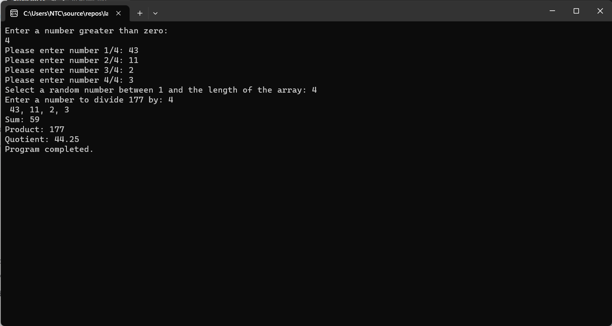

# Number Games

## Description:
<hr>

In this lab we worked on a mini game that takes a number from the user and this number choose the array size that he will input each of its elements as integers if he did not input integers the exception will appear which will tell the user the number is not the right format then the game will ask the user to input an integer in the range of (1 - the input number).
Then it will ask him to input a number to dived the product(the total summation of the numbers multiplied by the number of the total array numbers). 
And at the end it will show the result of ever element for example(sum , product and the division etc.).

## code: 
```c#
{ namespace lab_1
  { class Program
    {
        static void Main(string[] args)
        {
            try
            {
                StartSequence();
            }
            catch (Exception ex)
            {
                Console.WriteLine($"An error occurred: {ex.Message}");
            }
            finally
            {
                Console.WriteLine("Program completed.");
            }
        }

        static void StartSequence()
        {
            Console.WriteLine("Enter a number greater than zero:");
            int size = Convert.ToInt32(Console.ReadLine());
            int[] numbers = new int[size];

            numbers = Populate(numbers);

            int sum = GetSum(numbers);
            int product = GetProduct(numbers, sum);
            decimal quotient = GetQuotient(product);
            for (int i = 0; i < numbers.Length; i++)
            {
                if (i < numbers.Length - 1)
                {
                    Console.Write($" {numbers[i]},");
                }
                else
                {
                    Console.Write($" {numbers[numbers.Length - 1]}");
                }
            }
            Console.WriteLine(" ");
            Console.WriteLine($"Sum: {sum}");
            Console.WriteLine($"Product: {product}");
            Console.WriteLine($"Quotient: {quotient}");
        }

        static int[] Populate(int[] numbers)
        {
            for (int i = 0; i < numbers.Length; i++)
            {
                Console.Write($"Please enter number {i + 1}/{numbers.Length}: ");
                string input = Console.ReadLine();
                numbers[i] = Convert.ToInt32(input);
            }

            return numbers;
        }

        static int GetSum(int[] numbers)
        {
            int sum = 0;
            foreach (int number in numbers)
            {
                sum += number;
            }

            if (sum < 20)
            {
                throw new Exception($"Value of {sum} is too low");
            }

            return sum;
        }

        static int GetProduct(int[] numbers, int sum)
        {
            Console.Write("Select a random number between 1 and the length of the array: ");
            int randomNumber = Convert.ToInt32(Console.ReadLine());

            if (randomNumber < 1 || randomNumber > numbers.Length)
            {
                throw new IndexOutOfRangeException("Index is out of range.");
            }

            int product = sum * numbers[randomNumber - 1];
            return product;
        }

        static decimal GetQuotient(int product)
        {
            Console.Write($"Enter a number to divide {product} by: ");
            string input = Console.ReadLine();
            int divisor = Convert.ToInt32(input);

            try
            {
                return decimal.Divide(product, divisor);
            }
            catch (DivideByZeroException)
            {
                Console.WriteLine("Divide by zero error.");
                return 0;
                //ffffffff
            }
        }
    } 
    }
```


## This is how it should look like:
<hr>



